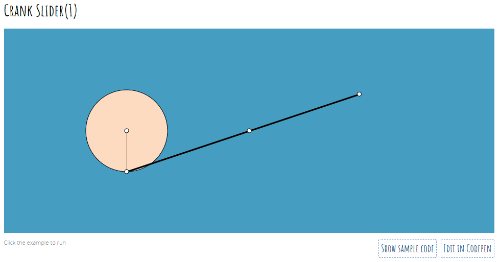

Some time ago I talked about [CFDG](https://lochrist.github.io/blog/2017-04-21-cfdg) which is a way to create art using a "context free grammar". This allowed a *maybe* less technical person to generate art according to simple description way easier than a full programming language. Basically this:

```
startshape start
background{b -1}
 
rule start {
    fadespiral {f 90 b 1}
}
 
rule fadespiral {
    CIRCLE {}
    fadespiral {x .9 r -4 s .997 b -.0001 hue .01}
    line {r -45 sat 1 hue 200 a -.65}
}
rule fadespiral .05 {
    fadespiral {hue .01}
    line {r 45 hue 260 sat 1 a -.65}
}
rule fadespiral .01 {
    fadespiral {f 90}
}
rule fadespiral .001 {
    start {s 4 x 25}
}
 
rule line {
    SQUARE { x .5 s .5 10 b 1}
}
```

Could turn into this:


## Processing

[Processing](https://processing.org/) is the more technically advance way to create art. It was created so non-developer could use a simple, yet powerful [API](https://processing.org/reference/) to generate drawings.

Processing is a Mac/Windows/Linux **java** (sigh) app.


It allows a user to use a custom scripting language to turn this:

```javascript
PVector location;  // Location of shape
PVector velocity;  // Velocity of shape
PVector gravity;   // Gravity acts at the shape's acceleration

void setup() {
  size(640,360);
  location = new PVector(100,100);
  velocity = new PVector(1.5,2.1);
  gravity = new PVector(0,0.2);

}

void draw() {
  background(0);
  
  // Add velocity to the location.
  location.add(velocity);
  // Add gravity to velocity
  velocity.add(gravity);
  
  // Bounce off edges
  if ((location.x > width) || (location.x < 0)) {
    velocity.x = velocity.x * -1;
  }
  if (location.y > height) {
    // We're reducing velocity ever so slightly 
    // when it hits the bottom of the window
    velocity.y = velocity.y * -0.95; 
    location.y = height;
  }

  // Display circle at location vector
  stroke(255);
  strokeWeight(2);
  fill(127);
  ellipse(location.x,location.y,48,48);
}
```

Into this:


The Processing Language has supports for classes, functions, lots of data structures, all sorts of drawing APIs, input management and even a bit of IO (read/write files).

## P5

I am sure that in 2001, when Processing started it was all well and good to have a java app running a *custom* programming language (simpler than java). But it is 2017 and the browser is where it is at! Enters [P5](https://p5js.org/), the javascript version of Processing.

The [API](https://p5js.org/reference/) is similar (but not identical) and it is a pure javascript library so you can benefit from the browser debugger, from a known and prowerful programming language and from the welath of libraries available everywhere on github. Also, it is mighty easy to embed you p5 examples in a web page:

<iframe src='../examples/p5/p5.html' frameborder="0" width='680' height='400'></iframe>
*Click on the canvas to restart the simulation.*

The p5 documentation is good containing both [tutorials](https://p5js.org/tutorials/) and many [examples](https://p5js.org/examples/). The [Getting Started](https://p5js.org/get-started/) setup is quite nice as well and easy to get going. If you use the basic functionalities of p5 you do not even need a web server. Everything can be loaded in your browser page locally:


## Similarities to Glowscript

A few weeks ago I talked about [Physics Simulation Programming](https://lochrist.github.io/blog/2017-06-17-physics-simulation-programming). The tech I talked about: [Glowscript](http://www.glowscript.org/) is also a javascript based tech that allows the same kind of functionalities as P5 but it adds 3D support. I haven't use those 2 technologies enough to know their key differentiators but both seems super nice to use in the context of education as they allow non-developer to easily simulate any kind of shapes interactions.

## Using P5 to show visual Math and Physics

What lead me to P5 in the first place is a tweet by [kynd](https://twitter.com/kyndinfo). kynd was linking to its **great** [examples](https://kynd.github.io/p5sketches/index.html) pages containing a bunch of p5 examples using math and physics.

Those examples are all [*Code Pen*](https://codepen.io/kynd/pen/oYVPbz) enabled and are thus easy to modify and to tweaks. Some examples are almost hypnotic like the Crank Slider:




