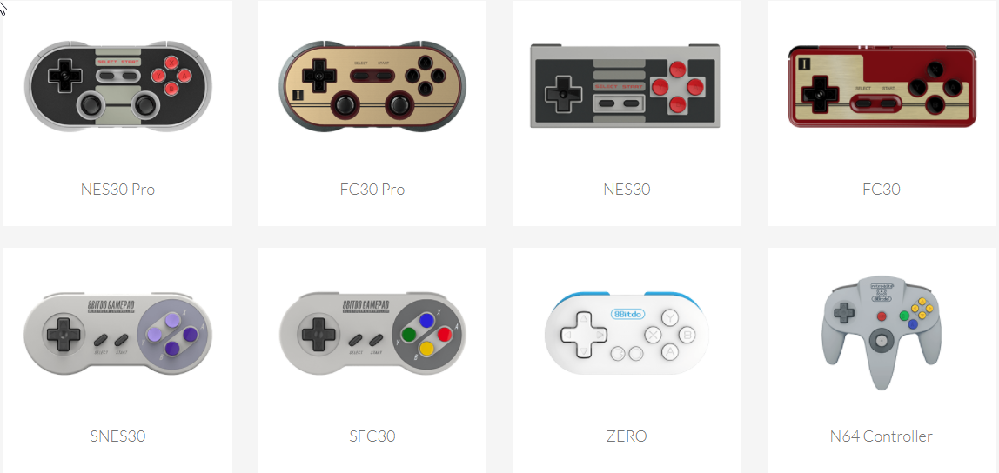

With the advent of the [RaspberryPi](https://www.raspberrypi.org/) we have seen a resurgence of retro gaming using emulators.

## Retro consoles

You can find great resources on how to easily build your own console from a Raspberry Pi. This [tech radar article](http://www.techradar.com/news/gaming/how-to-turn-your-raspberry-pi-2-into-a-retro-games-console-1289146) showcase evertyhing you need to know about building your own console.

The web site [Retro Pie](https://retropie.org.uk/) is even more complete as it shows how to use a Rasberry Pi, a PC or a ODroid C1/C2 into a retro-gaming machine. It comes with a specifically built flavor of Linux Debian (Raspbian) and a slew of emulators.

## Retro Controllers
But there can't be real retro gaming if you do not have access to a retro controllers. And this is where the [8bitdo](http://www.8bitdo.com/nes30-fc30/) site has your back. They have a wide range of controllers:

And each of those controllers is SUPER flexible in that they work on Windows, Android, mac, iOs, Steam, on a Rapsberri Pi and even on the Switch! Their firmware are updated regularly to support new platforms. You can even buy a stand that turns your phone into a mobile gaming console (think old school Nintendo Advance).

