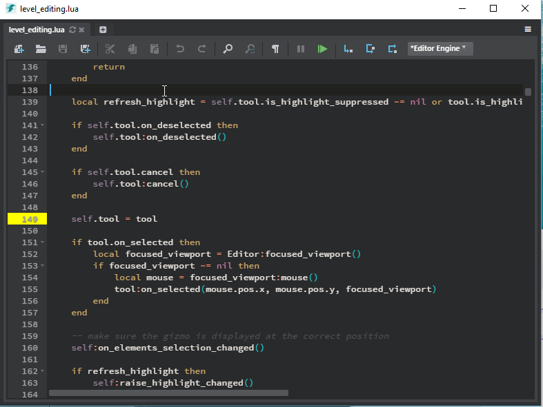
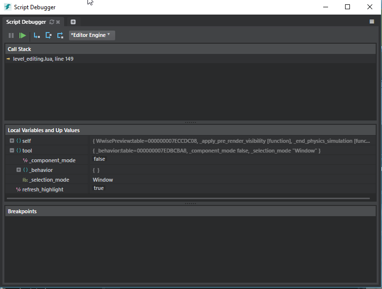

What makes development efficient and fun for me is powerful debugging tools. I will admit I am a sucker for a good IDE that allows me to both code AND debug in the same space. Visual Studio for C++ and C# is the best IMO IDE on the market. Bar none. On Javascript side I really like [Webstorm](https://www.jetbrains.com/webstorm/). But I starting to warm up to [Visual Code](https://code.visualstudio.com/) as well.

### Stingray and Lua

When developing gameplay code in Stingray (or when developing new Viewport tools for the editor) we use [Lua](https://www.lua.org/). Lua is a really small and powerful scripting language that has been around forever (before Python even!). It is SUPER fast. And it is super easy to integrate inside an existing engine.

The Problem with Lua and Stingray: the tools we ship with Stingray to develop in Lua are not that great. Our script editor (based on [Ace](https://ace.c9.io/)) is ok at best. But any developer will have its favorite editor and won't use our built in editor anyway.



Our debugging environment is ok. We built it ourselves and it works. But since we do not put a lot of development in it is is missing some key features: good auto completion, good code navigation, search in files...



Let's face it: creating a development environment is a full time job and we do not have the resources to dedicate to this endeavor. Wouldn't it be great if we could add Stingray debugging functionalities to an already super great editor that is well maintained and loved but many developers?

### Stingray VS Code Integration

Enter [Stingray Lua Integration for Visual Code](https://marketplace.visualstudio.com/items?itemName=jschmidt42.stingray-debug). During our last hackday, I helped our [lead tools developer](https://github.com/jschmidt42) create this already great but still heavily a work in progress integration:


This is still in heavy development but we already supports lots of features:

- breakpoints
- variables inspection and lua table expansion
- sending engine scripts
- sending engine commands
- printing string id
- debug both gameplay code and editor code

During the next few hackdays we will continue to pimp out this extension and make it as good as possible. It might even motivate us to create more Lua content :)

For the curious, you can look at the code of the extension [here](https://github.com/jschmidt42/stingray-vscode-debugger).

### VS Code Debugger

The fact that we were able to create this extension in a little bit more than a hackday is a testament to how easy it is to build extensions for Visual Code. The documentation is good. This [section](https://code.visualstudio.com/docs/extensions/example-debuggers) explains how to create a new debugger integration. It is a bit high level (and you will need to dig into the low level details soon enough) but still good.

What really made this easy for us was the *Markdown debugger* that was created as a tutorial on how to create a new debugger. You can get this example on github:

```
git clone https://github.com/Microsoft/vscode-mock-debug.git
cd vscode-mock-debug
npm install
```

Basically we only had to derive from the `BaseSession` class and fill out the [functions](https://github.com/jschmidt42/stingray-vscode-debugger/blob/master/src/stingray-debugger.ts). The fact that `BaseSession` is a typescript class helps to document all the API. It was one of our first typescript experience with Stingray and things went well. Typescript is really well supported within VSCode itself.

