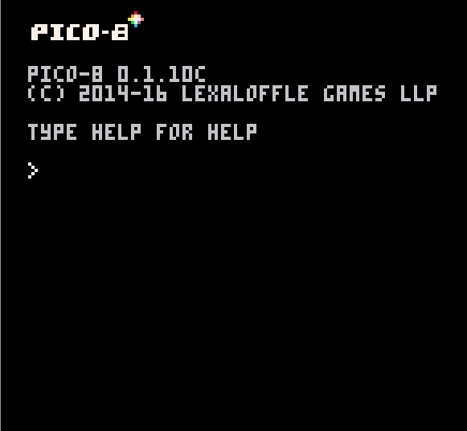
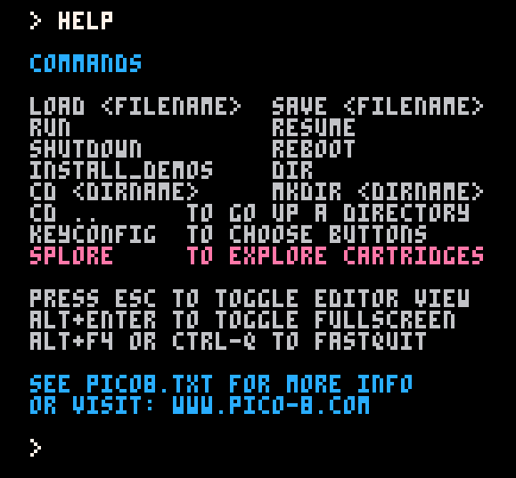
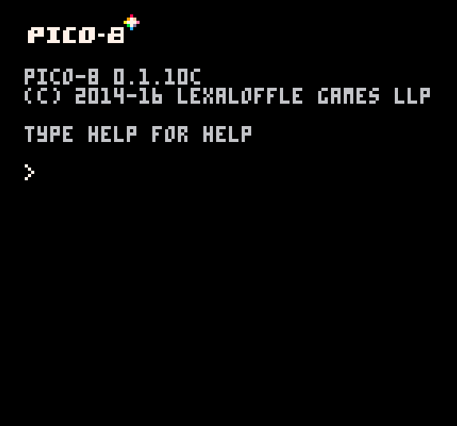
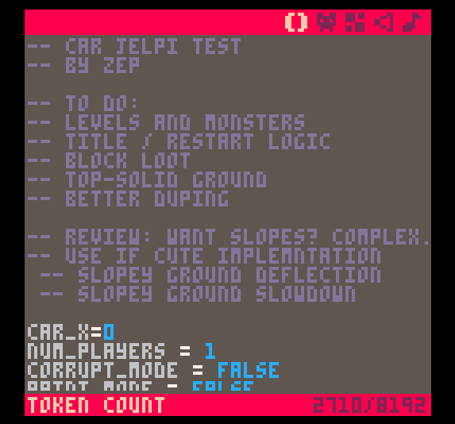
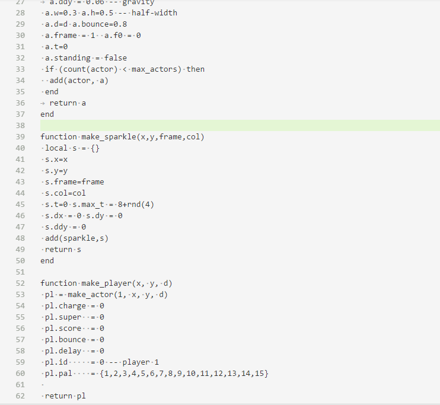
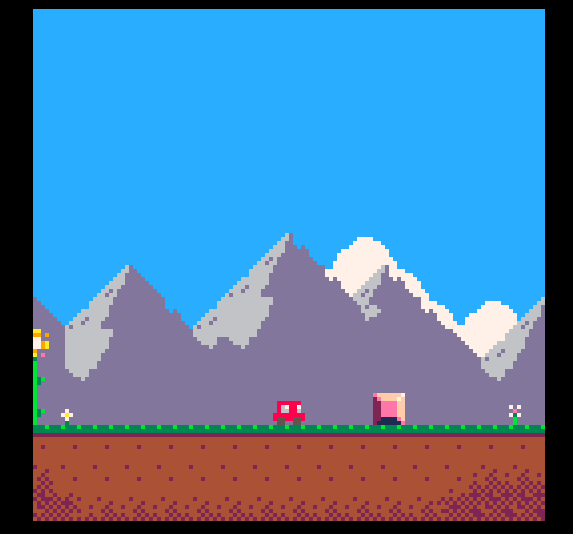

What could be more meta than writing a game for a console that doesn't really exists. Writing a game for a *Fantasy console?* This is what [Lexaloffle](http://www.lexaloffle.com) is proposing with its [Pico-8](http://www.lexaloffle.com/pico-8.php) plaftorm. The spec of your game will be :

- Display		128x128 16 colours
- Cartridge Size		32k
- Sound		4 channel chip blerps
- Code		Lua
- Sprites		128 8x8 sprites
- Map		128x32 cels
- Controls		D-pad + 2 buttons

When you start pico-8 you get this:

An empty prompt waiting for you to access the console. If you type help you get:

And then you can start your adventure in *fantasy console land*:

But how do you develop a game for a console like this? Turns out the there is even a code editor!

Granted 128x128 is not great for editing code. The good news is that you can modify the *cartridge* code from your favorite editor and hot reload the game from the console:

You will write your game in [Lua](https://www.lua.org/) using a few primitives functions provided by the Console OS. The [documentation]() is great and it explains from sound design to sprite manipulation with even a Lua Primer.

### Brief Lua moment of Awe
This is the 3rd time I recently wrote about Lua (see [Stingray Lua debugger](https://lochrist.github.io/blog/2017-03-25-stingray-lua-debugger) and [Torch](https://lochrist.github.io/blog/2017-04-05-recurrent-neural-networks-and-music)). I am amaze how this super simple language can creep in some of the least expected place. Ease of integration and a SUPER small footprint makes wonder. 

### Back to developing a console game

Pico-8 comes even with a simple Level editor! Barebone but workable.

For debugging purposes, there is memory inspector coupled with a profiler:

All in all, this makes for a tight constrained developing environment that would be a great challenge for a game jam. Who wouldn't want to write a Mario clone like this on a tiny *tiny* screen:

