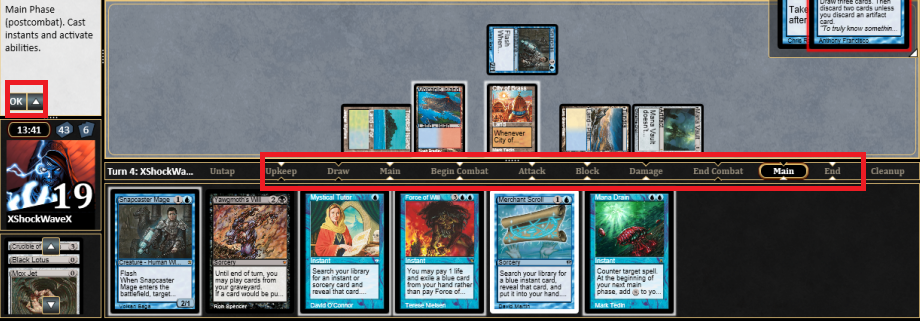

### Magic the Gathering - Paper

[Magic the Gathering](http://magic.wizards.com/en) is the granddaddy of all customizable Card game. It started the whole genre. It is the richest, it has more than 15000 unique cards, three constructed formats (Legacy, Modern, Standard) that are supported by a strong tournament structure. It even has a Pro Tour and a World Championship. 

But this is a complex game. The [Turn structure](http://www.essentialmagic.com/rules/turnstructure.asp) allows players to interrupt each other at a lot of different phases (or steps). There is even a sophisticated ["Stack Mechanism"](http://www.essentialmagic.com/articles/thestack.asp) that is used to resolve all sorts of "simultaneous" triggers. Players can add to the stack as they want and when each other passes, all the triggers are resolved in Stack order (from last in- first out).

When you play "paper" Magic with a friend or at a tournament, the game is fluid. You use a lot of "language shortcuts" to signify that you either want to process to the next phase or that you want to do something BEFORE the end of the current phase (ex: before the end of your turn I cast a [Dig Through Time](http://gatherer.wizards.com/Handlers/Image.ashx?multiverseid=386518&type=card)).

### Magic the Gathering Online

The digital implementation of Magic aims at EXACTLY recreating the paper game. With the same cards and rules. It is even used as a qualifier for some "paper" Pro Tour. This means ALL the steps and phases and possible interruption points exist. And it means that has a player you take a lot of time to it the "OK" button telling that you are done with a specific phase or sequence of triggers.

This makes MTGO a game that is difficult to get into for a beginner. Add this to the fact that the implementation of the game looks like a mediocre 2005 game AND that the client is Windows only and you get computer game that is only played by the REALLY motivated players. It seems the client base doesn't grow, Twitch streaming is super marginal compared to comparable games like Hearthstone.

### Hearthstone - Digital

[Hearthstone](http://us.battle.net/hearthstone/en/) is clearly a simplified Magic clone. It has all the same core gameplay elements: Mana, Creatures attacking an opponent and Spells. But the biggest difference is that it was built from the ground up to be a streamlined computer game. There is no way to interrupt your opponent. In fact, during your opponent turn you CANNOT do a thing except maybe watch one of your "secret cards" triggers itself automatically. 

Each turn even has a time limit. So you know for sure that you won't wait a long time before playing your next turn.This, combined to the slick User Interface and the smooth animations makes Hearthstone the King of the Hill in terms of Digital Card Game. There are always around 100K twitch viewers at about any hour of the day!

### Epic - Paper and Digital

[Epic](http://www.epiccardgame.com/) has started its life as a pure card game. It was similar to Magic: creatures, spells and life points. But it got really streamlined both in terms of Resource management: you have only a single "Mana" (called gold) during your turn and one during your opponent's turn. And most cards cost either one Gold or no gold at all. Contrary to Hearthstone you can play cards during your opponent's turn but only at some really specific time: when a creature is attacking you or at the end of the other player's turn.

Recently, Epic has released a [digital](https://www.kickstarter.com/projects/1172937197/epic-digital-card-game) alpha version of their card game.

Even though Epic is simpler than Magic and has less interruption points you could see in the digital version of the game that the constant "pressing OK button to pass to the next phase" was making the flow of the game choppier than it should be.

### Epic rules evolution

So Epic has done the unthinkable. They have changed the rule of the game (this will affect "paper" game as well) in order to make the Digital version smoother! [Rules changes](http://www.epiccardgame.com/rules-changes-april-2017/) have been annonced recently and they are subtle but effective in maximizing the number of "decisions" you can take before passing priority to your opponent.

### Mulligan Change

When starting a game of Epic, you could put on the bottom of your deck any cards you didn't like and draw as many to replace it. The first player would *mulligan* and then the second.

In the Digital game this would lead to the following sequence:

1) Player 1 mulligans. 
2) Player 1 presses OK to pass priority.
3) Player 2 mulligans
4) Player 2 presses OK to pass back to priority.
5) Player 1 can start with its first turn of the game.

With the new rules:

1) Player 2 mulligans. 
2) Player 2 presses OK to pass priority.
3) Player 1 Mulligans.
4) **Player 1 can start with its first turn of the game.**

One less clicks and priority change!

### Battle Sequence Change

The is a similar tweaks in the battle sequence. Currently the Attacker is the first player to be able to play Events and special abilities both after declaring attacker(s) and after the defender has selected its blocker(s). 

With the rule changes, after having declared its Blocker(s) the **defender keeps priority** and can play Events and special abilities. Again: not a breaking change, but one less click!

### Magic Digital Next

Wizards of the Coasts has annonced its [Magic Digital Next](http://magic.wizards.com/en/articles/archive/magic-digital/magic-digital-next-2017-02-17) initiative. During the next year, they will announce changes to the "Digital" presence of Magic hoping to be more competitive against the Hearthstone of this world. Will there be rules changes? A totally new implementation of MTGO that would be disjoint of the paper game? One thing is certain though: it can't be worst than how things are at the moment.