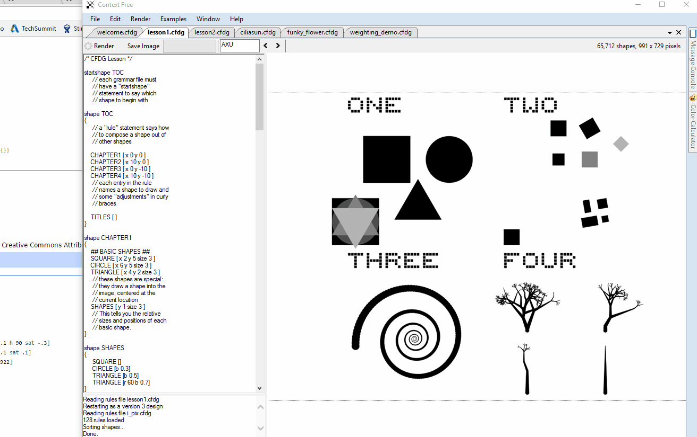
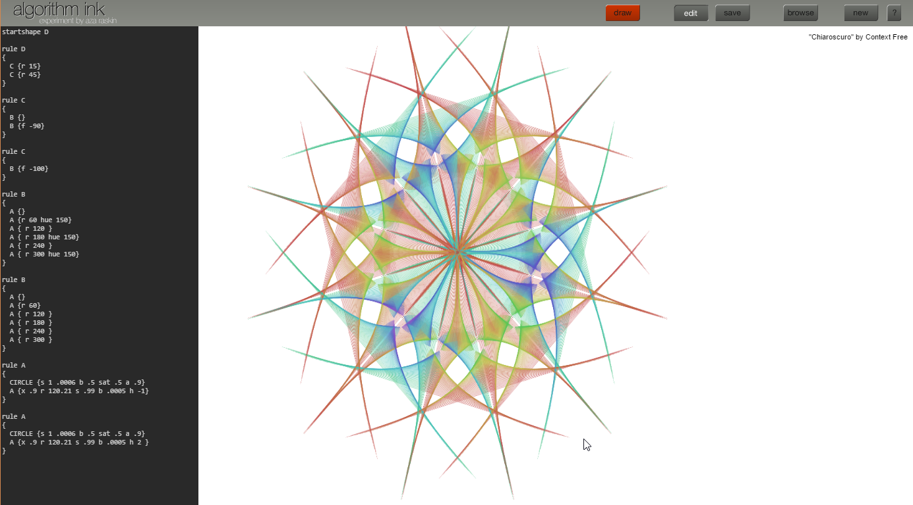
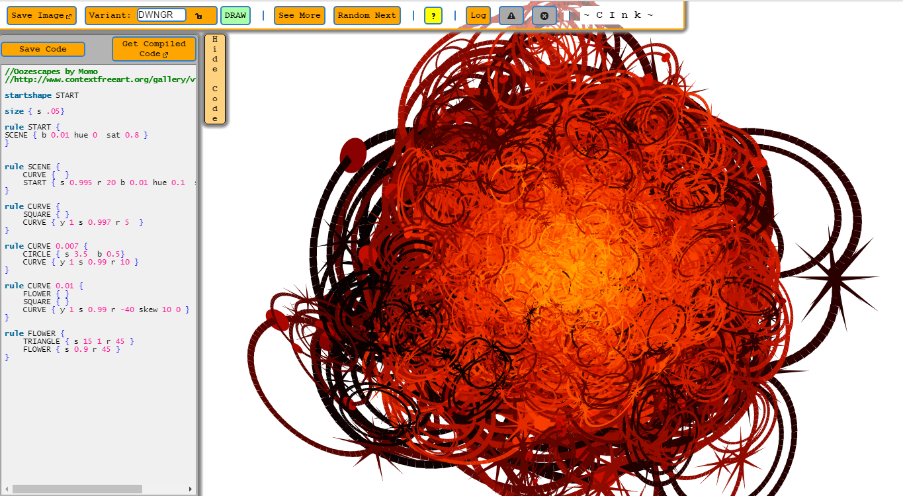
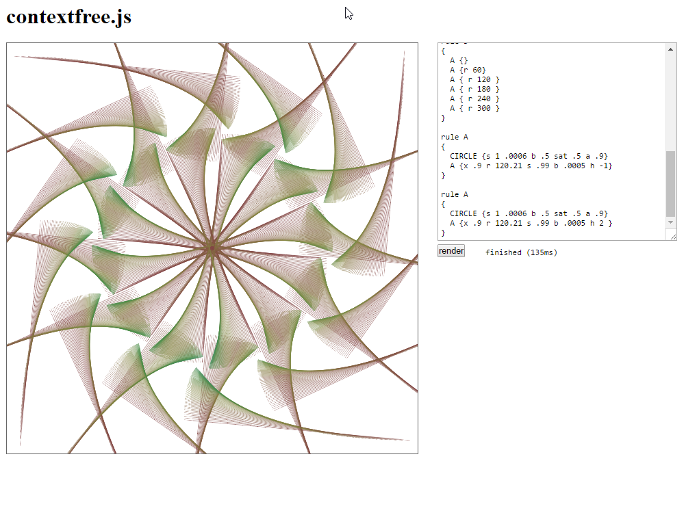

While looking for cool Single File C library, I found this one: [noc_turtle](https://github.com/guillaumechereau/noc) through the great [list](https://github.com/nothings/single_file_libs) compiled by Sean Barrett.

### CFDG
noc_turtle is a C implementation of the *Context Free Design Grammar* concept. CFDG allows a coder/artist to turn this definition:

```
background{b -1}
startshape init
rule init{turn[b 1 a -1 sat 1 h 310]}
rule turn{
    SQUARE[x .5 y -.05 s 1 .1]
    CIRCLE[x 1.77 y .13 s .5]
    turn[z 1 r -2.07028 s 0.298966      a .1 h 90 sat -.3]
    turn[z 1 x 1 r 45.9297 s .324258    a .1 sat .1]
    turn[z 1 x 1.72574 y .806014 r -48 s .922]
}
```

into this:


Pretty incredible! The CFDG language was designed by [Chris Coyne](https://chriscoyne.com/) and a lot of different apps have been made to render the definitions into pretty pixels. See Chris [gallery](https://www.flickr.com/groups/cfdg/pool/) for more awesome images.

## CFDG Editors

### [Context Free Official Site](https://www.contextfreeart.org)

From there  you can download an app that will allow you to test your artist/coding skills. The app is well made and contains a few great examples as well as 2 "lessons" in the form of images.



Over the web lots of github projects have pop up showcasing how you can implement a CFDG renderer in any programming languages. I have looked at the following Javascript implementation because they seemed really well coded and also because they have a CDFG web editor (no installation for the win!):

### [Algorithm-ink](http://azarask.in/projects/algorithm-ink/#b32debe8)
- Great editor
- Lots of examples
- The [blog](http://www.azarask.in/blog/post/contextfreejs-algorithm-ink-making-art-with-javascript/) contains some nice article highlighting how the javascript implementation was done.



### [CInk](http://cink.applegrew.com/art.html#)

- Great editor that allows "animation" of images
- The compiler is open source but the editor itself is not.



### [contextfree.js](https://github.com/alpicola/contextfree.js)

- Barebone editor
- The code of the editor and of the renderer is easy to understand and makes great use the latest capabilities of the Canvas.
- It uses [jison](https://zaa.ch/jison/) to generate the parser! 



### Chicken for the end

You gotta to like these chickens:


All done with this:

```
startshape S
 
background{ b -.6 h 270 sat .5 }
 
size { s 12 y -2 }
 
// standard pseudo-perspective trick
rule S{
    100* { y .05 b 0.005 h 1} SQUARE { b .4  s 12 .1  z -99  h 270 sat .5 } //
ground
    10*{s -.9 .9 .9 y .5 z -1 } {	8*{ x 1.22} element {x -4.25 |b 1} }
    }
 
 
 
//  a few churn rules to mix geometry up a bit.
rule element{element{ sat -.05 }}
rule element{element{ sat .05 }}
rule element 5{element{ h 223 }}
rule element { element{ x .12 } }
rule element { element{ x -.12 } }
rule element 2{ element{ y .05 z -.05} }
rule element 2{ element{ y -.05 z .05} }
rule element { element { s .97 1 1 }}
rule element { element { s 1.03 1 1 }}
rule element { element { s 1 .97 .97 }}
rule element { element { s 1 1.03 1.03 }}
rule element 2 { element { f 90 }}
 
// payload
rule element .1{ egg{}}
rule element .1{  chick{  }}
rule element .5{}
 
 
// drawing elements
rule mound{
    CIRCLE { s 2 1.5 y -1 z -1  sat -1}
    mound { s .999 .998 .999 b .003| h .05}
    }
 
rule spikeA{
    CIRCLE { s 1.5 1 y -1.5 z -1}
    spikeA { s .998 .999 .998 b .001| h .1 r .06}
    }
rule spikeB{
    CIRCLE { s 1.5 1 y -1.5 z -1}
    spikeB { s .998 .999 .998 b .001| h .1 r .01}
    }
 
rule spikey{
    spikeA{b .1 y 1 z 1}
    nextspikey{ r 10 s .85 .85 .95 |b -.03  }
    }
 
rule nextspikey .3{}
rule nextspikey .7{spikey{}}
 
// make drawing elements into something recognisable
 
rule egg{mound{ |b -.2  b .2 y 1 z 1 s .7 1}
    SHADE { s 2 .7 y -.666 z -20 }
    }
 
rule beak{spikeA{b .1 y 1 z 1}spikeB{b .1 y 1 z 1}}
 
rule chick{
    spikey{ sat .3 y .5}
    beak { f 45 s .25 z .2 x .5 y .5 b -.5 sat .2}
    2 * { x .08 y .025 } EYE { r 10 s .07 .2 x .44 y .77 z .9 b .1 }
    2 * { x .35 y .1 } spikeA { s -.4 .15 .1 x -.1 y -.5 b .25 |b -1 sat .3 }
    SHADE { s 2 .7 y -.666 z -20 }
    }
 
rule EYE{
    CIRCLE { b .9 sat .2 }
    CIRCLE { s .7 y -.2 }
    }
 
// stuff on the ground
rule SHADE{
    CIRCLE { a -.95 }
    SHADE { s .95 r 100 a -.05}
    }
 
rule SHADE .1 {
    2* { f 0 } SHADE { s .6 y .2 r 222 a -.5}
    }
 
 
rule SHADE .1 {
    SHADE{}
    5 * { r 70} MUCK {  s .3 x .5 }
    }
 
// ever seen a clean chook run?
rule MUCK 8 {MUCK { r 222 }}
rule MUCK {3 * { r 120  }MUCK { x .8 s .6 }}
rule MUCK 2 { MUCK { y 1 }}
rule MUCK {CIRCLE{ a -.8 }}
```

It is almost like magic!