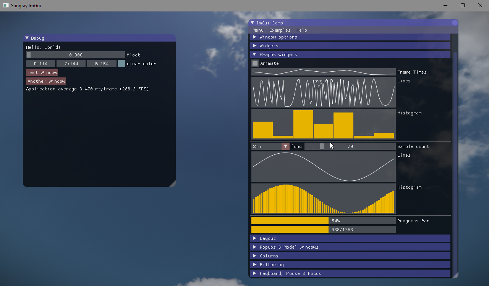

At Autodesk we have worked on a 2 weeks per sprint schedule. The last Friday of each sprint is the golden day of the week: this is the hackday! On hackday, we can work on anything that interests us as long as it is tech related: new features on Stingray, try out new technology, pair up with a colleague to test a game mechanic. Anything! More and more companies have a similar system: at Google employees can work 20% of their time on a side project. Same deal at Unity.

I feel ALL software companies should have hackdays. As a developer this is how you can get your *creative juice* flowing. After a tough sprint of debugging, this is where you can madly hack on a new tool using an untested technology. This is how you explore areas of the software you are less comfortable with (hello rendering).

On Stingray, lots of hackdays have been so successful they have evolved into real features or into *tutorial plugins* that showcase the different Stingray API. Here is a non-exhaustive list of cool things we have done recently:

### Mithril

We now use [Mithril](https://mithril.js.org/) for most of our new UI in Stingray. I discovered Mithril during a hackday when I tried different web technologies to improve the performance of our Property editor.

### Stingray Lua Debugger

We created a [VSCode extension](https://github.com/jschmidt42/stingray-vscode-debugger) allowing a developer to integrate with the Stingray Lua debugger during a hackday! We obviously put a little bit more than a single day on this, but it all started as a hackday challenge.

### Storm Cloud

[Storm Cloud](https://github.com/jschmidt42/storm_cloud) is our server to run and stream Stingray viewport on the cloud. You can then publish your Stingray app or games on the cloud and play it from your browser. This is a proof of concept and it would need a lot more work to improve latency and streaming quality but it is still good start! We created this during a hackdathon (3 hackdays). 

### IMGUI

We integrated a [plugin](https://github.com/jschmidt42/imgui-cmake) to expose the famous [Dear IMGUI](https://github.com/ocornut/imgui) library into Stingray.

### Clouds
Check out this Volumetric Cloud plugin for Stingray. All done during a few hackdays.

### Unit generation on the Cloud

Lately I worked on a Stingray plugin that integrates with an Autodesk Script service to generate Shape on the Cloud. When the shape is generated, I save it as a Stingray Unit that can then be used in a level.

