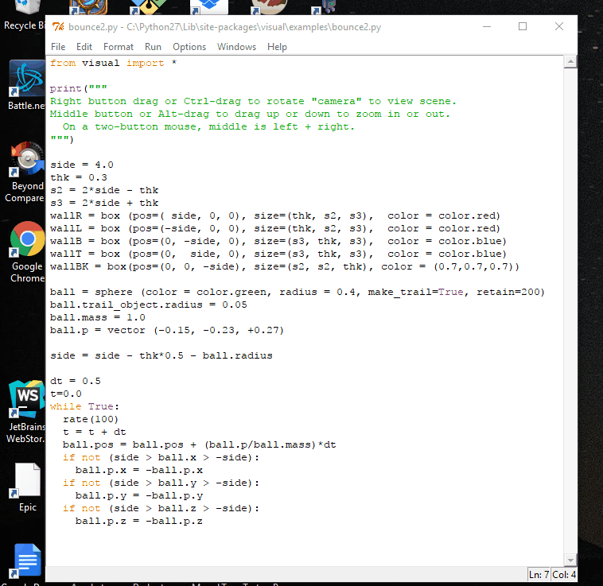
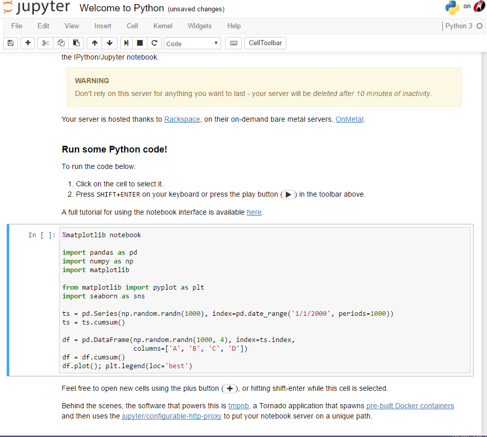

My girlfriend is a physics *cegep* teacher. For those not in the know, or not leaving in Quebec, Canada, Cegep is a weird grade between Highschool and University. Next session, she wants to try the next big thing: introduce its students to *physics simulation programming*. I am on duty to help her find the best technology to achieve this. What do we have on the market?

### VPython
[VPython](http://vpython.org/) is the grand daddy of this type of stuff. It is a [Python](https://www.python.org/) library using [wxWidgets](https://www.wxwidgets.org/) to display windows, widgets and especially a 3D canvas allowing users to easily make objects move on screen according to easy to simulate equations. The whole package is easy to learn since Python is probably the easiest languages to learn. Here is an example of a python program making a ball bounce on screen:

```python
from visual import *

print("""
Right button drag or Ctrl-drag to rotate "camera" to view scene.
Middle button or Alt-drag to drag up or down to zoom in or out.
  On a two-button mouse, middle is left + right.
""")

side = 4.0
thk = 0.3
s2 = 2*side - thk
s3 = 2*side + thk
wallR = box (pos=( side, 0, 0), size=(thk, s2, s3),  color = color.red)
wallL = box (pos=(-side, 0, 0), size=(thk, s2, s3),  color = color.red)
wallB = box (pos=(0, -side, 0), size=(s3, thk, s3),  color = color.blue)
wallT = box (pos=(0,  side, 0), size=(s3, thk, s3),  color = color.blue)
wallBK = box(pos=(0, 0, -side), size=(s2, s2, thk), color = (0.7,0.7,0.7))

ball = sphere (color = color.green, radius = 0.4, make_trail=True, retain=200)
ball.trail_object.radius = 0.05
ball.mass = 1.0
ball.p = vector (-0.15, -0.23, +0.27)

side = side - thk*0.5 - ball.radius

dt = 0.5
t=0.0
while True:
  rate(100)
  t = t + dt
  ball.pos = ball.pos + (ball.p/ball.mass)*dt
  if not (side > ball.x > -side):
    ball.p.x = -ball.p.x
  if not (side > ball.y > -side):
    ball.p.y = -ball.p.y
  if not (side > ball.z > -side):
    ball.p.z = -ball.p.z
```



By looking at that program we see tha VPython provides the heavy lifting for all the stuff a Physics students don't want to handle himself: creating 3D objects (boxes and ball), handling camera manipulation and initializing the 3D environment.

In my opinion, the only downside to VPython for a student (and teacher) perspective is that you need to have a computer with Python installed and install VPython itself as well. A difficult endeavor as my girlfriend school the IT managers are next to useless and they prevent anybody from installing anything on any computers.

### Glowscript
All of those IT woes are taken care of by [Glowscript](http://www.glowscript.org). Glowscript is basically VPython (it is by the same author: the prolific [Bruce Sherwood](https://github.com/BruceSherwood)) in the web! The Glowscript web site allows users to enter and runs their programs directly from the Glow script web site.

Here is the bouncing ball available right in your [browser](http://www.glowscript.org/#/user/GlowScriptDemos/folder/Examples/program/Bounce). If you look at the [code](http://www.glowscript.org/#/user/GlowScriptDemos/folder/Examples/program/Bounce/edit) there is a small surprise though:

```javascript
GlowScript 2.5 JavaScript
/* A ball bounces in a box. */

// This is written in "synchronous" style, with an infinite while loop animation.

function display_instructions() {
    var s = "In GlowScript programs:\n\n"
    s += "    Rotate the camera by dragging with the right mouse button,\n        or hold down the Ctrl key and drag.\n\n"
    s += "    To zoom, drag with the left+right mouse buttons,\n         or hold down the Alt/Option key and drag,\n         or use the mouse wheel.\n"
    s += "\nTouch screen: pinch/extend to zoom, swipe or two-finger rotate."
    scene.caption = s
}

scene.title = "A ball bounces in a box"
// Display text below the 3D graphics:
display_instructions()

// Display text below the 3D graphics:

var side = 4.0
var thk = 0.3
var s2 = 2*side - thk
var s3 = 2*side + thk
var wallR = box ( {pos:vec( side, 0, 0), size:vec(thk,s2,s3),  color : color.red} )
var wallL = box ( {pos:vec(-side, 0, 0), size:vec(thk,s2,s3),  color : color.red} )
var wallB = box ( {pos:vec(0, -side, 0), size:vec(s3,thk,s3),  color : color.blue} )
var wallT = box ( {pos:vec(0,  side, 0), size:vec(s3,thk,s3),  color : color.blue} )
var wallBK = box( {pos:vec(0, 0, -side), size:vec(s2,s2,thk), color : color.gray(0.7)} )

var ball = sphere ( {color : color.green, size : 0.8*vec(1,1,1)} )
ball.mass = 1.0
ball.p = vec (-0.15, -0.23, +0.27)
attach_trail(ball, {pps:200, retain:100})

side = side - thk*0.5 - ball.size.x/2
var dt = 0.3

while ( true) { 
  // The rate statement tells GlowScript to execute the while statements
  // about 200 times per second. The "wait" keyword is necessary to permit
  // periodic updates to the window.
  rate(200,wait)
  ball.pos = ball.pos + (ball.p/ball.mass)*dt
  if (! (-side < ball.pos.x && ball.pos.x < side)) { 
    ball.p.x = -ball.p.x
  }
  if (! (-side < ball.pos.y && ball.pos.y < side)) { 
    ball.p.y = -ball.p.y
  }
  if (! (-side < ball.pos.z && ball.pos.z < side)) { 
    ball.p.z = -ball.p.z
  }
}
```

The whole example is in javascript and not Python! I honestly don't think javascript is significantly more difficult to learn than Python, so I wouldn't say this is a downside of Glowscript. But anyway with the help of [rapydscript-ng](https://github.com/kovidgoyal/rapydscript-ng) you can even run Python example (identical to VPython). By chaning the initial Glowscript declaration at the beginning of the script you fully have access to VPython:

```python
GlowScript 2.5 VPython

scene.caption = """Right button drag or Ctrl-drag to rotate "camera" to view scene.
To zoom, drag with middle button or Alt/Option depressed, or use scroll wheel.
    On a two-button mouse, middle is left + right.
Touch screen: pinch/extend to zoom, swipe or two-finger rotate."""

side = 4.0
thk = 0.3
s2 = 2*side - thk
s3 = 2*side + thk

wallR = box (pos=vector( side, 0, 0), size=vector(thk, s2, s3),  color = color.red)
wallL = box (pos=vector(-side, 0, 0), size=vector(thk, s2, s3),  color = color.red)
wallB = box (pos=vector(0, -side, 0), size=vector(s3, thk, s3),  color = color.blue)
wallT = box (pos=vector(0,  side, 0), size=vector(s3, thk, s3),  color = color.blue)
wallBK = box(pos=vector(0, 0, -side), size=vector(s2, s2, thk), color = color.gray(0.7))

ball = sphere (color = color.green, radius = 0.4, make_trail=True, retain=200)
ball.mass = 1.0
ball.p = vector (-0.15, -0.23, +0.27)

side = side - thk*0.5 - ball.radius

dt = 0.3
def move():
    rate(200, move)
    ball.pos = ball.pos + (ball.p/ball.mass)*dt
    if not (side > ball.pos.x > -side):
        ball.p.x = -ball.p.x
    if not (side > ball.pos.y > -side):
        ball.p.y = -ball.p.y
    if not (side > ball.pos.z > -side):
        ball.p.z = -ball.p.z

move()
```

There is a slew of [examples](http://www.glowscript.org/#/user/GlowScriptDemos/folder/Examples/) from GlowScript. Some examples are in javascript, others in VPython and some are even on coffeescript (is it really an advantage???). Note that all of those languages are *transpiled* to javascript. So even if you use VPython you WON'T have access to any python libraries. Only the core languages and VPython.

As a side note, VPython and Glowscript are both open source projects. You can find their repo on github [here](https://github.com/BruceSherwood/vpython-wx) and [here](https://github.com/BruceSherwood/glowscript). 

### Jupyter

[Jupyter](http://jupyter.org/) seems to be the next step to all of this. I haven't had time to properly try the tech but it appears to be MUCH more than VPython. Jupyter is a general project that allows scientists to create *living web document* that can contain code (in more than 40 languages including python), UI and plain old text. Those interactive document can be shared on the web or you can install your own instance of Jupyter locally on your machine.

For an example of Jupyter in your browser check [here](https://try.jupyter.org/). And select a python document. You will get something like this:



The ever prolific Bruce Sherwood has created a VPython package [for Jupyter](https://github.com/BruceSherwood/vpython-jupyter).

### Verdict

By far the easiest package to use is GlowScript. Not installation, all your homework can be shared and are hosted on the cloud. What more can you want? Now I just have to teach javascript to my girlfriend and expect her to be a good programming teacher for her students!