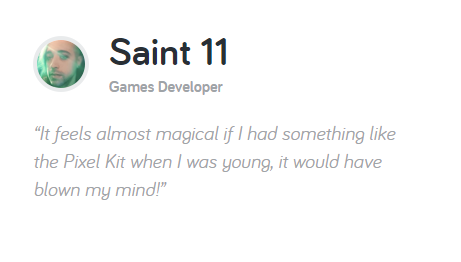

Always on the lookout for the latest geeky gadget, I found this great company called [kano](https://kano.me) that specializes in *gadgets that you assemble yourself and that involve programing*. They sell mainly 2 products:

## Computer Kit

This is a *computer* (made out of a raspberry Pi) that you assemble yourself and that you can hook to any HDMI display (you ca even buy the [screen kit](https://kano.me/store/row/products/screen-kit) if you feel like adding your custom display). 

The whole package is SUPER kid-friendly. The promotional video shows primary school kids building this thing and starting programming with it. The set of instructions is colorful:

It runs its own custom *KanoOS* and it is fully [community driven](https://world.kano.me/start):

Personally, I found the keyboard (and the chip) to be super slick:

### Pixel Kit

Their second product and the one I found awesome (BUT THAT DOESN'T SHIP TO CANADA!) is the [Pixel Kit](https://kano.me/store/row/products/pixel-kit). Think a programmable [Lite Brite](https://en.wikipedia.org/wiki/Lite-Brite):

with some buttons for more interaction:

On a Mac or PC, you can use a visual programming language or javascript to control how the gizmo behave.

You can program games, animation or even react to sound! All of your programs can be shared with others using the [Kano World](https://world.kano.me/shares?_ga=2.13773367.1245536632.1500038135-1853154920.1500038135) network. 

I was thrilled to see this product has the full endorsement of [Saint11](https://twitter.com/saint11?lang=en) author of the great Pixel Art [tutorials](https://www.patreon.com/saint11) that I talked about in an earlier [post](https://lochrist.github.io/blog/2017-03-13-pixel-art).

