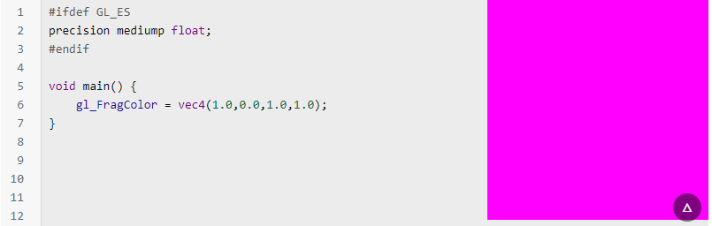
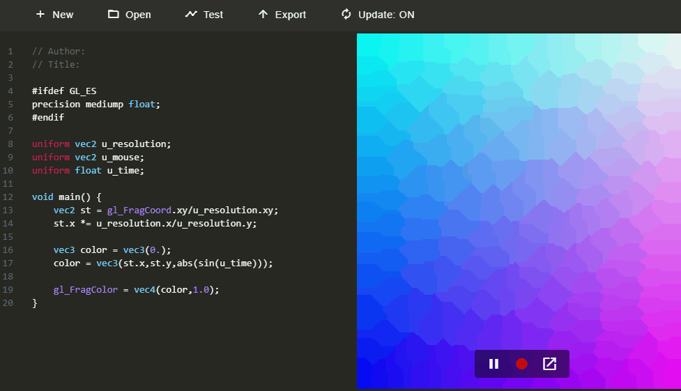

[Stephanie Hurlburt](https://twitter.com/sehurlburt) has recently called out all graphics programmers to send tutorials that could benefits aspiring novice programmers. I will admit I am a total noob to any fancy pixels thingy. So I took onto myself to found and read at least 2 of those tutorials to learn a bit about this arcane (for me at least) domain of knowledge. Here are some of my findings:

## Tell it with words

I read this article called [Graphics In Plain Language](https://renderdoc.org/blog/Graphics-in-Plain-Language/) first. This is a post by [Baldur Karlsson](https://twitter.com/baldurk) explaining only with words (no code, no equation) what a modern graphic pipeline is. There are a lot of images (most of them taken from Watchdog) showing *partially rendered* frames and how some *shading passes* impact rendering. This is a great read for ANYBODY interested in video game graphics. Even for non technical reader.

## Interactive coding

[The book of Shaders](https://thebookofshaders.com/) is an ongoing project (the book is not completed yet) by [Patricio Gonzalez Vivo](http://patriciogonzalezvivo.com/) and [Jen Lowe](http://jenlowe.net/). And this book is on the total opposite of the previous article. It is full of interactive snippets of shader code that you can modify and and see what results are produced by those modifications.



What is super impressive with this book is all the interative tools Patricio has created to allow mundane users (like myself) to test shader code. This [page](https://thebookofshaders.com/04/) highlights all the ways you can easily run some shader code. Some of the more impressive tools are:

### glslCanvas
[glslCanvas](https://github.com/patriciogonzalezvivo/glslCanvas): Patricio has created an html/js plugin to easily hook a shader fragment to a canvas and see it evaluation live. You can specify the whole configuration of your shader using only a simple `<canvas>` tag:

```html
<canvas class="glslCanvas" data-fragment-url=“yourShader.frag" data-textures=“yourInputImage.png” width="500" height="500"></canvas>
```

This is the directives Patrio use in the book to update all the "dynamic" canvas when you modify shader code.

### glslViewer

[glslViewer](https://github.com/patriciogonzalezvivo/glslViewer) is the *desktop* counterpart of glslCanvas. It is an app that runs on Linux/MacOS (and Raspberry Pi) and that allows you to modify a text file containing your shader and see the results live:


### Shader Online Editor

Pigging backing on glslCanvas there is the [online editor](http://editor.thebookofshaders.com/) that allows you to create, save and share new shader. From the web page, you can edit code and review the results live:

You can even record a sequence showing how your shader evolves in time like the *sin-color-modifying* shader here:



### The rest...

No stone are left unturned and Patrico gives examples on how to run shader in [Processing](https://processing.org/) (which I briefly talked about [here](https://lochrist.github.io/blog/2017-07-24-processing-with-p5)), in [Three.js](https://threejs.org/) and in [Open Framework](http://openframeworks.cc/).

## What to do with shader

The Book of Shaders is not just about tools on how to run shaders. It is mostly about content you can generate with the actual shader code. There is a section on Algorithmic drawing that covers Functions, Colors and Patterns. There is also a section on Generative Designs coering Noise and Fractals. All the *book chapters* are full of interactive code snippets. 

## Stingray Rendering

Any post on rendering wouldn't be complete without giving a shoutout to [Tobias Persson](@tobias_persson) last mega contribution to Stingray: [The Ultimate Stingray Renderer Walkthrough](http://bitsquid.blogspot.ca/2017/02/stingray-renderer-walkthrough.html)! This walthrough covers everything from render contexts to how Stingray uses resources with a detour explaining all the render devices and the data-driven rendering API. This walkthrough is pure gold for anybody interested in the implementation of a quality real-time renderer.

## A rendering guru in the making

Taking over the mantle from Tobias, [JP](https://twitter.com/greje656), one of our rendering expert, has been on a tear with 2 great rendering blog posts in the past month:

- [Physically based lens flare](http://bitsquid.blogspot.ca/2017/07/physically-based-lens-flare.html)
- [Validating Materials and Lights](http://bitsquid.blogspot.ca/2017/07/validating-materials-and-lights-in.html) in Stingray.