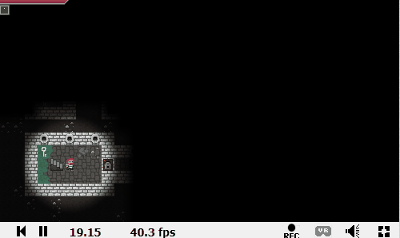

My last post about [Pixel Dungeon](https://lochrist.github.io/blog/2017-08-05-pixel-dungeon) contained a bit of a lie. I didn't randomly (re)discovered the game on my phone. I actually tried to buy the game after having seen this amazing [demo](https://www.shadertoy.com/view/Xs2fWD) on shadertoy (and THEN I discovered I already bought the game a year ago and it was sitting on my phone):

Sorry for the gif quality. Click the demo link and actually try it. There is even a nice soundtrack! I am kind of [noob](https://lochrist.github.io/blog/2017-07-26-rendering-and-graphics-for-dummies) to Graphics Programming but I was amazed that you could actually code a game **IN** a shader. 

### Other toys

Shadertoy is chuck full of incredible demos. Here are some that impressed me. 

[Tiny Earth](https://www.shadertoy.com/view/lt3XDM)

This demo contains a nicely rendered earth and clouds that move over continents.

[Billiards](https://www.shadertoy.com/view/MsGGD1)
This is a billiards game with physics and collisions.

