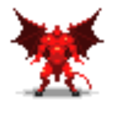
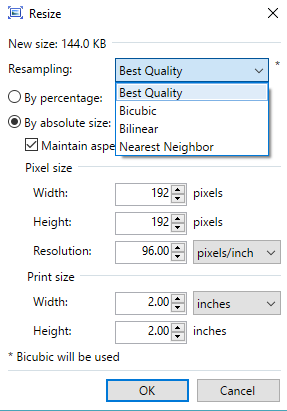
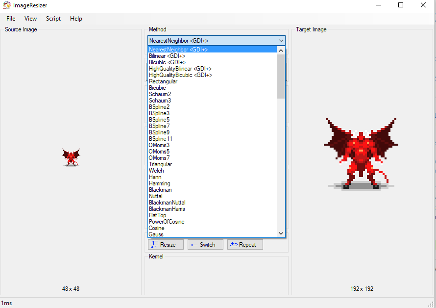
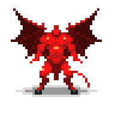
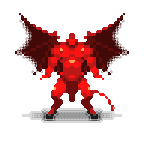
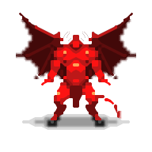

Over the past few weeks I used [PhaserJS](http://phaser.io/), the great 2D Web Game Engine to prototype a game using pixel art graphics from [Oryx Ultimate Fantasy Tileset](https://www.oryxdesignlab.com/products/ultimate-fantasy-tileset).

All the sprites in the tile set are super nice and evocative. But they are small:

48x48 pixels small to be precise!

Being the power user artist that I am, I decided to scale a bunch of the sprites using [Paint.Net](https://www.getpaint.net/). Little did I know I ended up with this (400% scaling):

Hum. Blurry and ugly. Where did I go wrong? Then I noticed the resize tool has multiple algorithm settings:

How come we get these result with a setting called: *Better quality*? I started hunting more information on what are the best ways of scaling Pixel Art. And down the rabbit's hole we go! Scaling those lovely pixels is a science into itself. Lots of progress have been made to accomodate all the new [Fantasy consoles](https://lochrist.github.io/blog/2017-04-08-fantasy-consoles-war) or old school console emulators.

This article highlight all the most important 
[Pixel art scaling algorithms](https://en.wikipedia.org/wiki/Pixel-art_scaling_algorithms). Most of these algorithms are made to be applied to a whole game frame and make it look good on today's display or TV. This [article](https://www.imagemagick.org/discourse-server/viewtopic.php?t=23046) showcases some of the most effective algorithms and shows the result of applying those filters on a Super Mario Bros image!

I wanted to see for myself and found a way to test what would be the best algo to use on the Red Demon sprite. I found this nice [Image Resizer tool](https://code.google.com/archive/p/2dimagefilter/downloads) that supports ALL scaling algorithms you can dream of. If you are a real artists you could use a more powerful tool like Photoshop or Gimp. But I like the fact that Image Resizer is totally dedicated to resizing:

The most well known and truly *pixel art effective* algorithm is Nearest Neighboor. Basically, one pixel becomes 4. Or more. This gives a totally legit pixel art look. But it can lead to image with lots of "stairs artifacts":

Some more advanced algorithms try to smooth pixels a bit. Here is what [Lanczos resampling](https://en.wikipedia.org/wiki/Lanczos_resampling) look like:

Good but too blurry. Another well known algo is Eagle (and [Super Eagle](http://segaretro.org/2xSaI)):

This is better but the wings are looking funny. Let's try another algo that has a great reputation: [HQx](https://en.wikipedia.org/wiki/Hqx)

This is getting better but the wings are blurry. Can we do better? Here is the result with [XBR](https://pastebin.com/cbH8ZQQT):

Wow this is truly nice. It doesn't look like Pixel Art anymore but it really produce a nicely scaled image.

