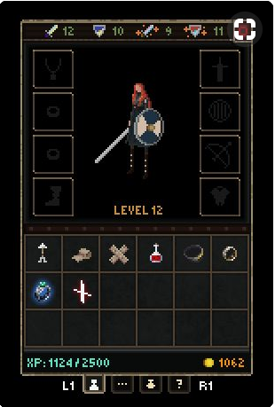
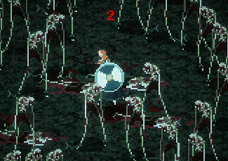
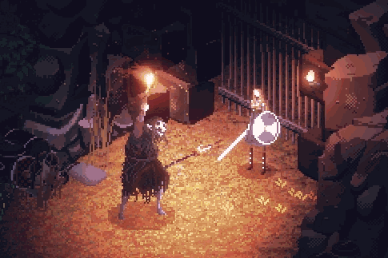
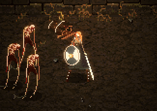

While looking on Pinterest for cool Pixel Art UI idea I found this image:

This lead me to the game called: [Eitr](http://eitrthegame.com/) which look really interesting both for his aesthetic and for gameplay. Horror-Viking-Action-RPG: sign me in! The Pixel Art graphics have so much movement it almost feels like an anime:

The game is not finished yet and I wasn't able to find a release date. But the developer's tumblr [blog](http://eitrthegame.tumblr.com/) gets updated often. Be sure to check it out for some awesome pixel art action!
