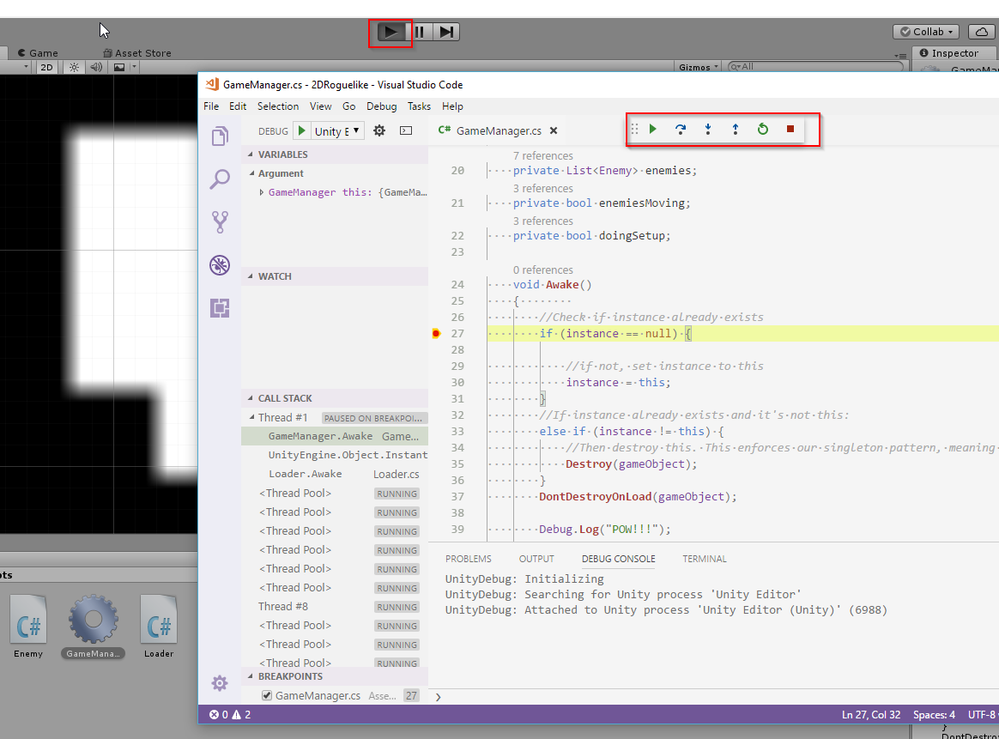

Last time I used Unity, I was on a Mac using [MonoDevelop](http://www.monodevelop.com/). I can't honestly say this was the best experience of my life. Things were working fine but I just didn't like this IDE.

## Because it is 2017: Visual Code!

To my pleasant surprise I noticed that there is now a [Visual Code Debugger extension](https://marketplace.visualstudio.com/items?itemName=Unity.unity-debug) for Unity available in the Visual Code Marketplace.

It is SUPER simple to setup:

1- In Unity Preferences

2- Then from Visual Code:

3- Put breakpoints anywhere in your code. Press F5 in Visual Code to attach to the Editor.

4- Start your game with Unity Editor:

Voila you are good to go!

